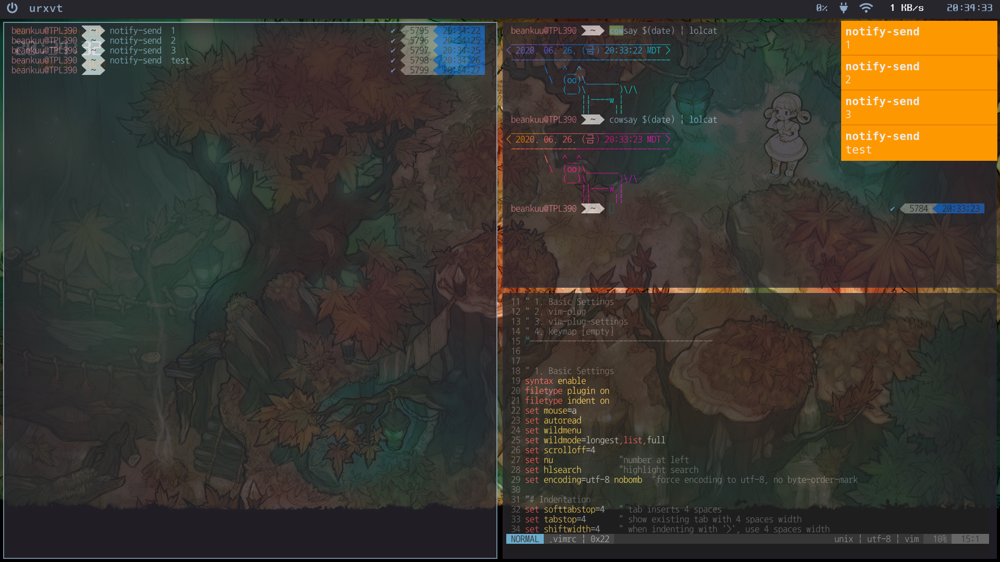
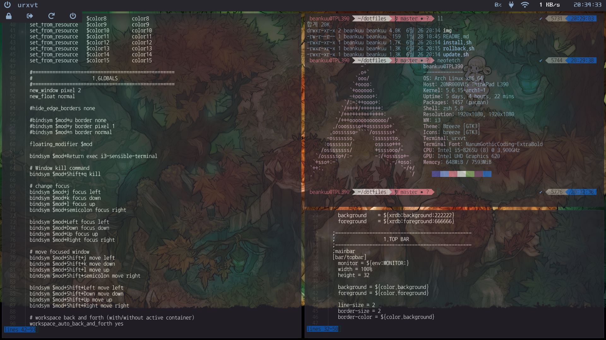

# dotfiles

### System
- ArchLinux, 5.6.15
- Lenovo TP L390
    - eDP1(laptop) & HDMI2(HDMI)

### Included config files
- i3-gaps
- polybar 
- rofi
- picom
- conky
- zshrc
- vimrc
- dunstrc
- X11
  - xbindkey
  - Xresources
  - xprofile

### requirement
- bash
- gnu-coreutils
- rsync

### comment
- background image: Tree of savior(game) official artwork
