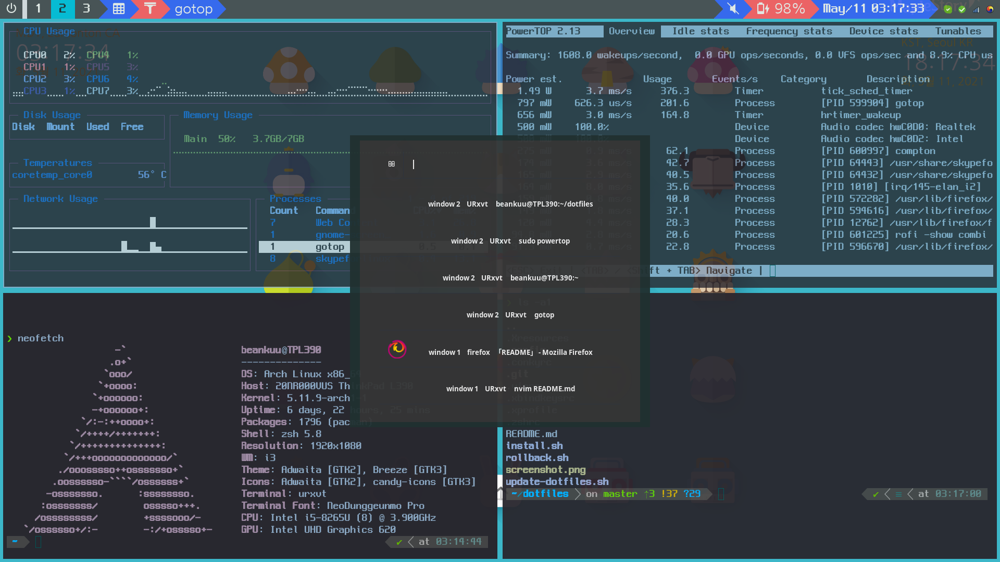

# dotfiles

### System

- OS: Linux (Arch)
- Device: Lenovo TP L390

### Included config files

| # | Terminal(URxvt) | GUI            |
|---|-----------------|----------------|
| 1 | zshrc           | i3-gaps        |
| 2 | vimrc           | polybar        |
| 3 | Xresources      | rofi           |
| 4 | Xprofile        | xbindkey       |
| 5 |                 | conky          |
| 6 |                 | dunstrc        |
| 7 |                 | picom(compton) |

### Comment
- Background source: [Nexon Maplestory Official Artwork](https://ssl.nx.com/s2/game/maplestory/renewal/common/media/artwork/artwork_14.jpg)

